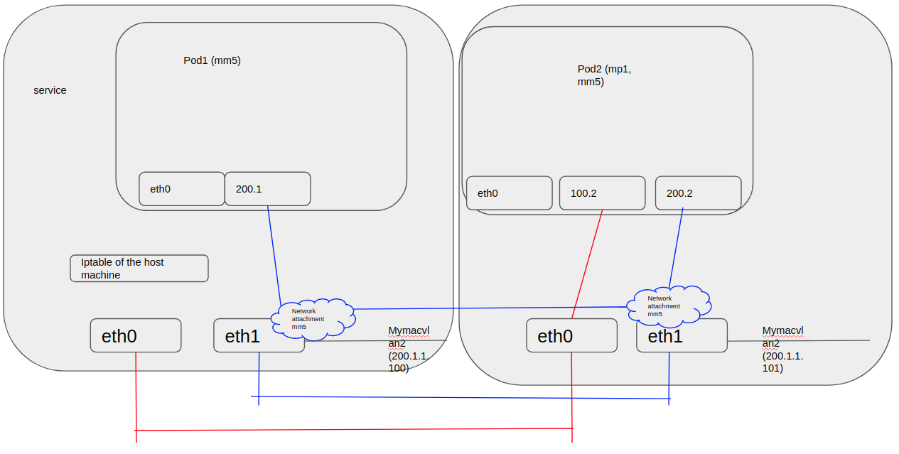
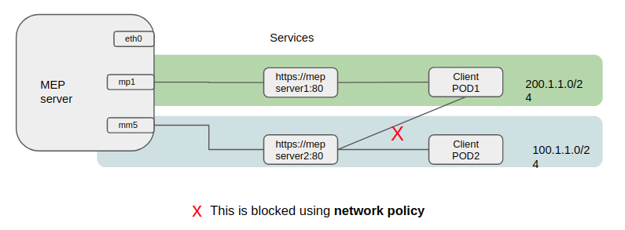
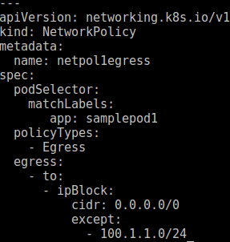

# Edgegallery Secondary endpoint controller Plugins

#### Introduction
Secondary ep controller get the ip address from pod's secondary interfaces which has been created by multus, and update the endpoint accordingly. 

#### How to use it
#####1. Make sure multus is running. Quickstart of multus.
```
kubectl apply -f  https://raw.githubusercontent.com/intel/multus-cni/master/images/multus-daemonset.yml
```
Details can be found here [multus quickstart and prerequisite](https://github.com/intel/multus-cni/blob/master/doc/quickstart.md)

#####2. Build and run edgegallery-secondary-ep-controller
```
$ git clone https://gitee.com/edgegallery/plugins/tree/master/edgegallery-secondary-ep-controller
$ build.sh
$ kubectl apply -f https://gitee.com/edgegallery/plugins/raw/master/edgegallery-secondary-ep-controller/deployments/rbac.yaml
$ kubectl apply -f https://gitee.com/edgegallery/plugins/raw/master/edgegallery-secondary-ep-controller/deployments/edgegallery-secondary-ep-controller.yaml
```
#####3. Define network attachments.
A sample network attachments (mp1-networkattachment.yaml)
```
apiVersion: "k8s.cni.cncf.io/v1"
kind: NetworkAttachmentDefinition
metadata:
  name: mp1
  namespace: mep
spec:
  config: '{
      "cniVersion": "0.3.0",
      "type": "macvlan",
      "master": "ens3",
      "mode": "bridge",
      "ipam": {
        "type": "host-local",
        "subnet": "200.1.1.0/24",
        "rangeStart": "200.1.1.2",
        "rangeEnd": "200.1.1.254",
        "routes": [
          { "dst": "0.0.0.0/0" }
        ],
        "gateway": "200.1.1.1"
      }
    }'
```
Below command will create a network name mp1 by multus.
```
$kubectl apply -f mp1-networkattachment.yaml
```
#####4. Create deployment and add an interface belongs to the network.
An example deployment yaml. Notice annontation part more networks using "," seperator.
```
apiVersion: apps/v1
kind: Deployment
metadata:
  name: hello
spec:
  selector:
    matchLabels:
      app: hello
  template:
    metadata:
      labels:
        app: hello
      annotations:
        k8s.v1.cni.cncf.io/networks: mep/mp1
    spec:
      containers:
        - name: hello
          image: "gcr.io/google-samples/hello-go-gke:1.0"
          ports:
            - name: http
              containerPort: 80
        - name: tcpdump
          image: corfr/tcpdump
          command:
            - /bin/sleep
            - infinity
```
Above yaml will add additional network to Pod ny multus.

#####5. Create service yaml and point the endpoint to that interface.
An example service yaml
```
apiVersion: v1
kind: Service
metadata:
  name: hello1
  annotations:
    k8s.v1.cni.cncf.io/networks: mep/mp1
spec:
  selector:
    app: hello
  ports:
  - protocol: TCP
    port: 80
    targetPort: http
```

#####6.Validate ip and points
```
root@k8-master:~# kubectl exec -it hello-9c56bdbb9-xbcp9 -n mep -- ip addr
1: lo: <LOOPBACK,UP,LOWER_UP> mtu 65536 qdisc noqueue state UNKNOWN qlen 1
    link/loopback 00:00:00:00:00:00 brd 00:00:00:00:00:00
    inet 127.0.0.1/8 scope host lo
       valid_lft forever preferred_lft forever
3: eth0@if52: <BROADCAST,MULTICAST,UP,LOWER_UP,M-DOWN> mtu 1450 qdisc noqueue state UP 
    link/ether a2:a7:91:e0:c3:b8 brd ff:ff:ff:ff:ff:ff
    inet 10.244.1.46/24 scope global eth0
       valid_lft forever preferred_lft forever
4: net1@if2: <BROADCAST,MULTICAST,UP,LOWER_UP,M-DOWN> mtu 1500 qdisc noqueue state UNKNOWN 
    link/ether b6:7d:53:84:79:e6 brd ff:ff:ff:ff:ff:ff
    inet 200.1.1.6/24 scope global net1
       valid_lft forever preferred_lft forever

$ kubectl get ep -n mep
NAME         ENDPOINTS          AGE
hello1   200.1.1.6:80     1m
```

###Limitation:
Currently edgegallery one click deployment scripts is using macvlan setup. Which may not work on multi node cluster. Its a lmitation of setup which will be rectified in further releases.

###Debugging Edgegallery network isolation setup
__1. Check Kubernetes version.__
Current version support for network isolation is 1.18.x. Below or latest version 1.19.x is not supported.
__2. Check Kubernetes distribution.__
K3s or other customized disctribution may not work since default multus setup need a default CNI to be run on /opt/cni/bin. We are working on it.
__3. Check multus is running__
Check multus is running in your system. (In kube-system namespace)
__4. Check eddge-gallery-ep-controller__
Check if ep controller is running or not. (In kube-system namespace)
__5. Check network attachments__
kubectl get network-attachment-definitions.k8s.cni.cncf.io
kubectl describe network-attachment-definitions.k8s.cni.cncf.io
__6. Check topology setup is ok or not__
Currently in our deployment we are using macvlan cni as a secondary network option.
If topology is ok, in this step we must have secondary interfaces inside the pod.  So we can try pinging them from the host. Go through below setups to check if we met the requirement.

####A Single Node single physical node deployment

In the above case network attachments can share a single physical interface. Same way if we have multiple physical interfaces we can use, but make sure physical interfaces do not belong to the same subnet. Note that physical interface and macvlan interface network can be different.
Two additional macvlan interfaces added to host to ensure traffic from host to pod or vice versa. Else pod to pod ping will work but service may not. Since service uses hosts ip table to route.

####A multi node deployment (Experimental)

In the above case to ensure connections between pods on different hosts we must ensure routing happens between hosts. This is a simple working deployment. eth1(the physical interface), macvlans should be in the same network to ensure routing between the hosts. All physical interfaces are in different networks too.


#####Network Policy:
In above cases since k8s will install default routes inside pods. We have network reachability to all networks via eth0. Right now we can't avoid it. So even if pod1 doesn't have access to the 100.x.x.x network it still can ping it and its service will be reachable. To block this we must use network policy. Since k8s now do not support multi-net network policy, we can have  a workaround like below.



So using this network policy on the client side we are allowing all traffic except which it should not be allowed to connect. Also note that to attach a network policy we must assign some label as pod selector.
